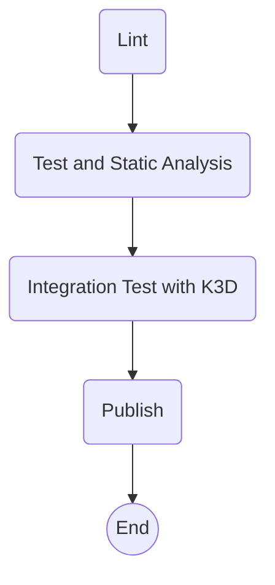

# plhello

It's a custom hello world service that based on environment variables to return a greeting.

## Requirements

[Go 1.19](https://go.dev/dl/) or higher.
[golangci-lint](https://golangci-lint.run/)


## Development

### Test and Lint

Test with coverage
```bash
go test -v ./... -covermode=count -coverprofile=coverage.out
go tool cover -html=coverage.out
```

Lint
```bash
golangci-lint run
```

### Build

```bash
cd $HOME/go/src/github.com/betorvs
git clone https://github.com/betorvs/plhello
cd plhello
go build
```

### Security Checks

Requirement: [Trivy](https://aquasecurity.github.io/trivy/).

```
cd $HOME/go/src/github.com/betorvs/plhello
trivy fs --security-checks vuln --exit-code 2 .
```

### Run it locally

```bash
export CUSTOMER_NAME="B"
export CUSTOMER_GREETING="Dear Sir or Madam"
./plhello
```

## Endpoints

### Health

```bash
curl http://localhost:9090/v1/health
```

### Greeting

```bash
curl http://localhost:9090/v1/greeting
```

## Documentation

It was documented using godoc format. To read it, use pkgsite package and run:

```bash
cd $HOME/go/src/github.com/betorvs/plhello
$HOME/go/bin/pkgsite .
```

Open in a [browser](http://localhost:8080/github.com/betorvs/plhello).

### pkgsite installation

[External post](https://medium.com/geekculture/release-your-go-package-on-pkg-go-dev-886ec42fbc77) about how to use go docs and pkgsite to run it locally.

```bash
go install golang.org/x/pkgsite/cmd/pkgsite@latest
```


## Kubernetes

Running it with kubernetes (locally). 

Requeriments:
- [docker](https://docs.docker.com/install/)
- [kubectl](https://kubernetes.io/docs/tasks/tools/#kubectl)
- [K3D](https://k3d.io/v5.4.6/)

### Pipeline proposed



### Using scripts

Create registry and cluster using K3D
```bash
./scripts/deploy-k3d.sh -c
```
Remember to add `127.0.0.1 k3d-customer-registry` to `etc/hosts` to be able to push images.

Build and push image to local registry
```bash
./scripts/build-n-push.sh "k3d-customer-registry:5050/plhello" "v0.1.0"
```

Deploy customer applications (-r means re-deploy, in case any change in examples/*yaml).
```bash
./scripts/deploy-k3d.sh -r
```

Test connection
```bash
./scripts/deploy-k3d.sh -t
```

Delete everything
```bash
./scripts/deploy-k3d.sh -d
```

Show Pods
```
./scripts/deploy-k3d.sh -l
```